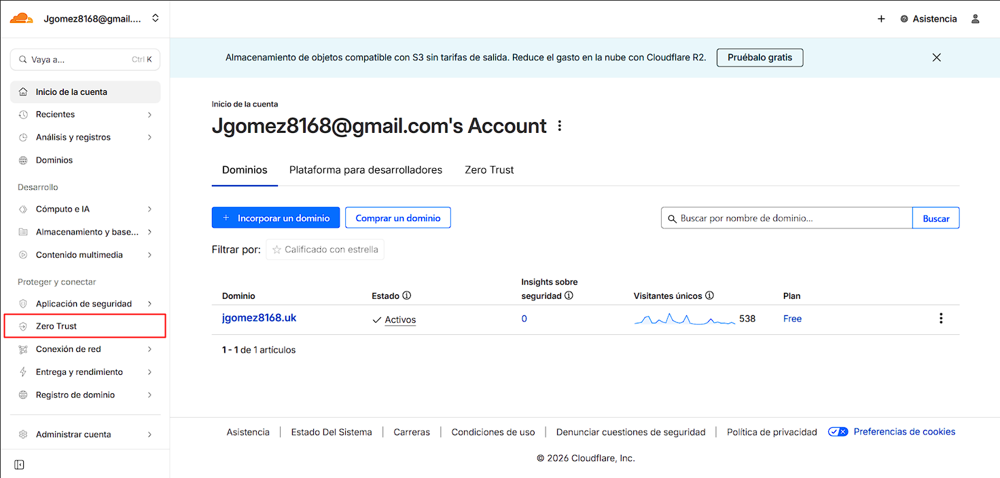
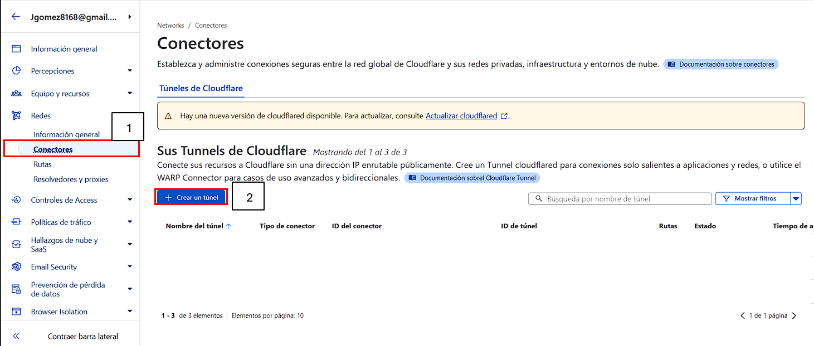
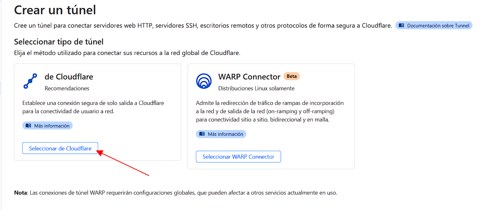
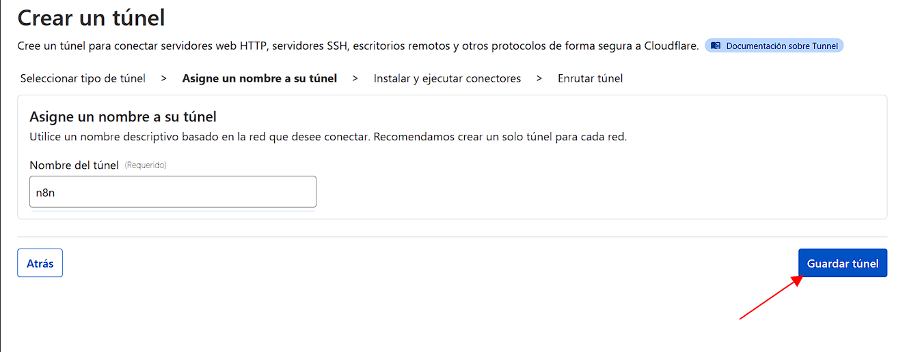
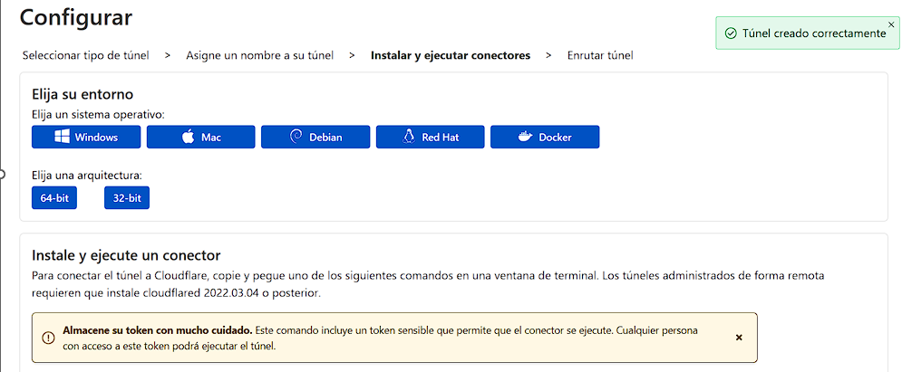

# Cloudflare Tunnel

Cloudflare Tunnel nos permite conectar de forma segura Cloudflare con nuestras aplicaciones desplegadas en local (o en un servidor privado) sin abrir puertos ni exponer la IP pública. En este repositorio vamos a crear un Tunnel para publicar y acceder a servicios como n8n mediante un dominio o subdominio, manteniendo el tráfico protegido y gestionado desde Cloudflare. [Documentacion oficial](https://developers.cloudflare.com/cloudflare-one/networks/connectors/cloudflare-tunnel/get-started/create-remote-tunnel/).

## Requisitos
Antes de crear el Cloudflare Tunnel, lo primero es tener tu dominio ya gestionado por Cloudflare. Si el dominio ya existe en otro registrador (GoDaddy, Namecheap, etc.), debes agregarlo a Cloudflare siguiendo esta guía: [Agregar un dominio existente a Cloudflare](https://developers.cloudflare.com/fundamentals/manage-domains/add-site/).

Si todavía no tienes dominio, puedes registrar uno directamente desde Cloudflare con: [Registrar un dominio con Cloudflare Registrar](https://developers.cloudflare.com/registrar/get-started/register-domain/), ya quedas preparado para crear el Tunnel y publicar un subdominio tipo n8n.tudominio.com.

## 1) Acceder al dominio en el que vamos a enrutar la aplicación
Antes de crear el Tunnel, asegúrate de que tu dominio ya está agregado a Cloudflare (requisito para publicar aplicaciones).

## 2) Ir al panel de Zero Trust y crear el Tunnel
1. Entra a Cloudflare One (Zero Trust).

2. Redes → Conectores, y clic en "Crear un túnel"

3. En tipo de conector, selecciona Cloudflared y clic en Next.

4. Asigna un nombre al túnel (ej: n8n) y clic en Guardar túnel.

5. Si se creó bien, quedas una pantalla que te muestra el siguiente paso para instalar y ejecutar cloudflared.

## 3) Ir al panel de Zero Trust y crear el Tunnel
# n8n-cloudflare
