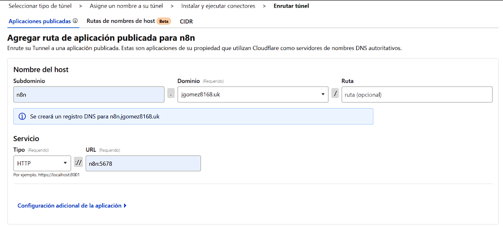
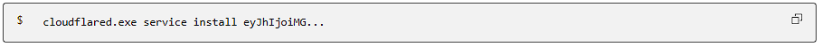

# Cloudflare Tunnel

Cloudflare Tunnel nos permite conectar de forma segura Cloudflare con nuestras aplicaciones desplegadas en local (o en un servidor privado) sin abrir puertos ni exponer la IP pública. En este repositorio vamos a crear un Tunnel para publicar y acceder a servicios como n8n mediante un dominio o subdominio, manteniendo el tráfico protegido y gestionado desde Cloudflare. [Documentacion oficial](https://developers.cloudflare.com/cloudflare-one/networks/connectors/cloudflare-tunnel/get-started/create-remote-tunnel/).

## Requisitos
Antes de crear el Cloudflare Tunnel, lo primero es tener tu dominio ya gestionado por Cloudflare. Si el dominio ya existe en otro registrador (GoDaddy, Namecheap, etc.), debes agregarlo a Cloudflare siguiendo esta guía: [Agregar un dominio existente a Cloudflare](https://developers.cloudflare.com/fundamentals/manage-domains/add-site/).

Si todavía no tienes dominio, puedes registrar uno directamente desde Cloudflare con: [Registrar un dominio con Cloudflare](https://developers.cloudflare.com/registrar/get-started/register-domain/), ya quedas preparado para crear el Tunnel y publicar un subdominio tipo n8n.tudominio.com.

## 1) Acceder al dominio en el que vamos a enrutar la aplicación
Antes de crear el Tunnel, asegúrate de que tu dominio ya está agregado a Cloudflare (requisito para publicar aplicaciones).

## 2) Ir al panel de Zero Trust y crear el Tunnel
1. Entra a Cloudflare One (Zero Trust).

2. Redes → Conectores, y clic en "Crear un túnel"

3. En tipo de conector, selecciona Cloudflared y clic en Next.

4. Asigna un nombre al túnel (ej: n8n) y clic en Guardar túnel.

5. Si se creó bien, quedas una pantalla que te muestra el siguiente paso para instalar y ejecutar cloudflared.

## 3) Agregar la ruta de “Aplicación publicada” (Public hostname)
1. En el túnel, ve a la pestaña Published applications.
2. En el Nombre del host:
- Subdominio: escribe el que desees (ej: n8n).
- Dominio: selecciona tu dominio del desplegable.
- Ruta (path): déjala en blanco si no vas a publicar por ruta (normalmente se deja vacío).
3. En Service:
- Type: selecciona HTTP
- URL: aquí depende de cómo lo tengas desplegado:
    - Si cloudflared corre en Docker y comparte red con n8n: n8n:5678
    - Si cloudflared corre en el host (no docker) y n8n está expuesto localmente: localhost:5678
    - Si tu contenedor no se llama n8n o usa otro puerto, ajusta a NOMBRE_CONTENEDOR:PUERTO.
4. Clic en Save para guardar la ruta publicada.

## 4) Token Cloudflare
Copia el token y guárdalo en un lugar seguro, ya que lo usarás para conectar tu servidor (o contenedor) con Cloudflare Tunnel. Si tu despliegue es diferente, en la pantalla “Instale y ejecute un conector” selecciona el entorno que corresponda (Docker, Linux, etc.) y copia el comando específico que Cloudflare te indica para realizar la conexión.
